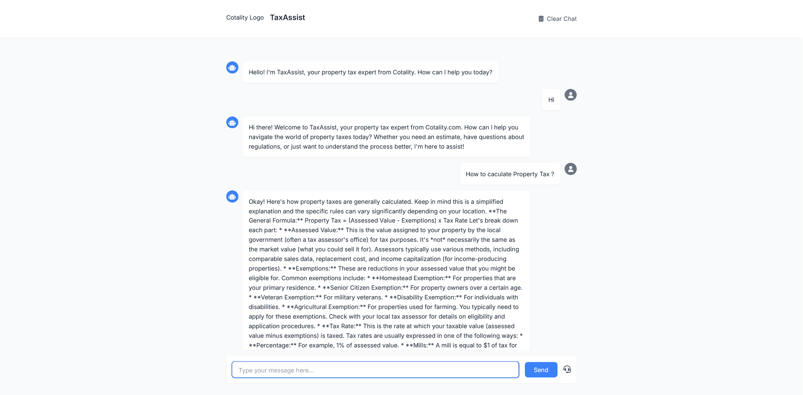

# TaxAssist - Cotality Property Tax Chatbot

TaxAssist is an intelligent chatbot designed to handle property-related tax queries for Cotality.com. It uses the Gemini API to provide accurate, timely, and user-friendly responses about property taxes, calculations, regulations, and guidance.

## Features

- Real-time property tax assistance
- Natural language understanding
- Tax calculation estimates
- Regulatory guidance
- Filing assistance
- Deadline reminders
- Escalation to human support
- Mobile-responsive interface
- Accessibility-compliant design

## Technical Stack

- Backend: Python Flask
- Frontend: HTML5, CSS3, JavaScript
- AI: Google's Gemini API
- Styling: Tailwind CSS
- Icons: Font Awesome
- Typography: Inter font family

## Setup

1. Clone the repository:
```bash
git clone [repository-url]
cd taxassist
```

2. Create and activate a virtual environment:
```bash
python -m venv venv
source venv/bin/activate  # On Windows: venv\Scripts\activate
```

3. Install dependencies:
```bash
pip install -r requirements.txt
```

4. Set up environment variables:
Create a `.env` file in the root directory with:
```
GEMINI_API_KEY=your_gemini_api_key
FLASK_ENV=development
DEBUG=True
```

5. Run the application:
```bash
python src/app.py
```

The application will be available at `http://localhost:5000`

## Usage

1. Open the application in a web browser
2. Type your property tax-related question in the chat input
3. Receive instant responses from TaxAssist
4. Use the "Clear Chat" button to start a new conversation
5. Click the headset icon to escalate to human support if needed

## Development

- The main application logic is in `src/app.py`
- Frontend templates are in the `templates` directory
- Static assets (CSS, JS, images) are in the `static` directory
- Styling customizations can be made in `static/css/style.css`

## Support

For support inquiries, contact:
- Email: supportUK@cotality.com
- Phone (UK): 0333 123 1417

## License

Copyright © 2024 Cotality.com. All rights reserved.

## Application Screenshot

Below is a screenshot of the TaxAssist chatbot interface:

